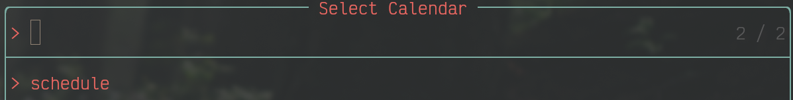
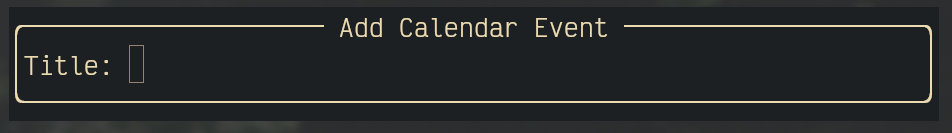
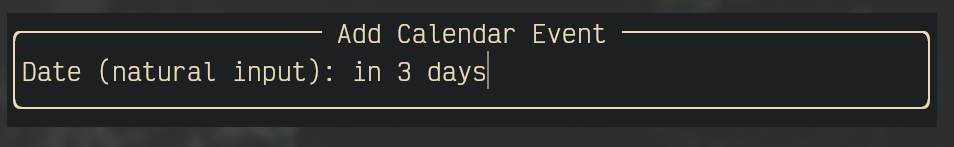

## Add and view Calendar events from google calendar from within neovim

## Features 

- Use natural language to create event
- Show list of events inside telescope


*Written in lua and python.*

> Lua

```lua
return {
	"adam-coates/nvim-calendar",
    dependencies = { "nvim-telescope/telescope.nvim" },
	config = function()
		require("nvim-calendar")
	end,
}
```

- Use command `:AddGoogleEventui` to bring up the ui helper to add an event step-by-step

- Select which calendar to add an event to



- Add title



- Use natural language to select the day of the event



- Use command `:Showevents` to bring up a calendar ui. Select a date from the calendar to view the events on that day
  

## Setup 

1. Install gcalcli & dateparser

`pip install gcalcli`

`pip install dateparser`

2. Generate google credentials 

[https://console.cloud.google.com](https://console.cloud.google.com)

    2a. Make a new New project
    2b. Enable Google calendar api (Api and services)
    2c. Create OAuth client ID 

Create a new project in GCP and go to Google APIs.
Click ENABLE APIS AND SERVICES add Google Calendar API.
Go to Google APIs and click OAuth consent screen from the sidebar.

    Choose External (Available to any user with a Google Account.) and click CREATE.
    Input your favorite name to Application name. In the Scopes for Google APIs section, click Add scope and add Google Calendar API ../auth/calendar.
    Click Save (DO NOT Submit for verification).

Go to the Credentials page from the sidebar.

    Create a new API key and restrict key to the two APIs (Google Calendar API, Tasks API).
        You have the api key.
    Create a new OAuth client ID. Select Desktop application for the application type.

3. Run gcalcli init

    2a. enter google client id 
    2b. enter google client secret

4. Run `gcalcli list` to check calendars are showing up


---

## Development
```[tasklist]
- [~] Events are now written to telescope ~create a full UI calendar in nvim written in lua (in progress)~
- [ ] https://github.com/adam-coates/nvim-calendar/issues/1
- [ ] Compatability for neovim on windows
- [x] Support for more than 1 calendar 
- [x] Create more in-depth instructions on how to obtain `credentials.json` in README.md
```

